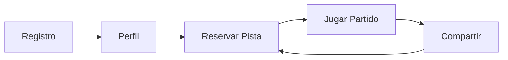
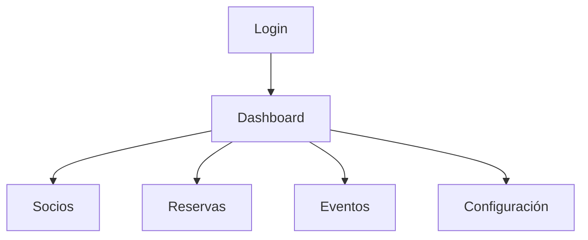

```
 ██████╗██╗     ██╗   ██╗██████╗     ██████╗  █████╗  ██████╗ ██╗   ██╗███████╗████████╗ █████╗ 
██╔════╝██║     ██║   ██║██╔══██╗    ██╔══██╗██╔══██╗██╔═══██╗██║   ██║██╔════╝╚══██╔══╝██╔══██╗
██║     ██║     ██║   ██║██████╔╝    ██████╔╝███████║██║   ██║██║   ██║█████╗     ██║   ███████║
██║     ██║     ██║   ██║██╔══██╗    ██╔══██╗██╔══██║██║▄▄ ██║██║   ██║██╔══╝     ██║   ██╔══██║
╚██████╗███████╗╚██████╔╝██████╔╝    ██║  ██║██║  ██║╚██████╔╝╚██████╔╝███████╗   ██║   ██║  ██║
 ╚═════╝╚══════╝ ╚═════╝ ╚═════╝     ╚═╝  ╚═╝╚═╝  ╚═╝ ╚══▀▀═╝  ╚═════╝ ╚══════╝   ╚═╝   ╚═╝  ╚═╝
```

> *"El mejor lugar para disfrutar de tu deporte favorito"*

# LA EXPERIENCIA CLUB RAQUETA 🎾🏸


<table>
  <tr>
    <td width="50%">
      <h2>🏆 ¿QUÉ NOS HACE DIFERENTES?</h2>
      <p>Club Raqueta no es solo una aplicación, es una <i>revolución</i> en la gestión de clubs deportivos.</p>
      <p>Desarrollada por amantes del deporte para amantes del deporte, nuestra plataforma elimina la fricción entre la tecnología y la experiencia deportiva.</p>
    </td>
  </tr>
</table>

## ⚡ CONSTRUIDO CON PASIÓN Y TECNOLOGÍA

<table>
  <tr>
    <td></td>
    <td><b>React 19</b><br><small>Frontend revolucionario</small></td>
    <td></td>
    <td><b>PHP</b><br><small>Backend potente</small></td>
  </tr>
  <tr>
    <td></td>
    <td><b>Tailwind CSS 4</b><br><small>Estilo elegante</small></td>
    <td></td>
    <td><b>MySQL</b><br><small>Datos robustos</small></td>
  </tr>
</table>

## 🔥 FUNCIONALIDADES QUE MARCAN LA DIFERENCIA

<details>
  <summary><b>🎮 Reserva Inteligente</b> - Un nuevo concepto de reservas</summary>
  
  * Vista inmersiva de calendario
  * Sistema de recomendación basado en hábitos
  * Recordatorios automáticos personalizados
  * Integración con calendarios externos
</details>

<details>
  <summary><b>👥 Comunidad Activa</b> - Más que un club, una familia</summary>
  
  * Perfiles de usuario interactivos
  * Sistema de emparejamiento para partidos amistosos
  * Foros de discusión por categorías
  * Compartir logros en redes sociales
</details>

<details>
  <summary><b>📊 Analytics Deportivos</b> - Datos que transforman el juego</summary>
  
  * Seguimiento de progreso personal
  * Estadísticas de uso de instalaciones
  * Informes de ingresos y ocupación
  * Predicción de demanda basada en IA
</details>

## 🔎 CÓMO DESPEGAR TU CLUB | MODO PROPULSIÓN 

<table>
  <tr>
    <td>
      <h3>💻 REQUISITOS TÉCNICOS</h3>
      <ul>
        <li>⚡ Node.js <code>v18.0+</code></li>
        <li>🏰 PHP <code>v8.0+</code></li>
        <li>📂 MySQL <code>v8.0+</code></li>
      </ul>
    </td>
    <td>
      <h3>⏱️ TIEMPO DE IMPLEMENTACIÓN</h3>
      <ul>
        <li>🟢 Básica: <b>1 día</b></li>
        <li>🟡 Estándar: <b>3 días</b></li>
        <li>🔴 Premium: <b>7 días</b></li>
      </ul>
    </td>
  </tr>
</table>

### ⛓️ DESPLIEGUE RÁPIDO

```bash
# 🔗 PASO 1: Clona el futuro de tu club
git clone https://github.com/ElTitoJuande/clubraqueta.git
cd clubraqueta

# 🎉 PASO 2: Prepara la magia frontend
cd Frontend && npm install

# 📦 PASO 3: Configura el motor backend
cp Backend/config.example.php Backend/config.php
echo "Edita config.php con tus credenciales de BD"

# 🚀 PASO 4: ¡Despega!
npm run dev
```

### 👤 SOCIOS | LA EXPERIENCIA DEFINITIVA

> "Club Raqueta transformó completamente nuestra forma de gestionar reservas" - *Miguel S., Club Tenis Sierra*



- **Pulsa para ser socio**: Registro único y personalizado para cada miembro
- **Tu espacio personal**: Dashboard interactivo con tu historial, reservas y progresos
- **Reserva en 3 toques**: Sistema intuitivo con sugerencias inteligentes
- **Conecta y compite**: Encuentra compañeros de juego compatibles con tu nivel

### 🛂 ADMINISTRADORES | CONTROL TOTAL



**Panel de control revolucionario** con:  
✅ Vista unificada de todas las operaciones  
✅ Métricas en tiempo real  
✅ Alertas personalizables  
✅ Flujos de trabajo optimizados  

## 🔵 API BLUE | INTEGRA Y EXPANDE

<div align="center">
  
</div>

> **Base URL:** `/api/v1`

<table>
  <tr>
    <th>RECURSO</th>
    <th>DESCRIPCIÓN</th>
    <th>ENDPOINTS DESTACADOS</th>
  </tr>
  <tr>
    <td><code>/auth</code></td>
    <td>Autenticación segura</td>
    <td><code>POST /login</code>, <code>POST /refresh</code></td>
  </tr>
  <tr>
    <td><code>/socios</code></td>
    <td>Gestión de miembros</td>
    <td><code>GET /{id}</code>, <code>PUT /{id}</code></td>
  </tr>
  <tr>
    <td><code>/reservas</code></td>
    <td>Sistema de reservas</td>
    <td><code>POST /new</code>, <code>GET /disponibles</code></td>
  </tr>
  <tr>
    <td><code>/eventos</code></td>
    <td>Gestión de eventos</td>
    <td><code>GET /proximos</code>, <code>POST /inscribir</code></td>
  </tr>
</table>

## 🏆 ÚNETE AL MOVIMIENTO

<table>
  <tr>
    <td width="60%">
      <h3>👥 COMUNIDAD EN CRECIMIENTO</h3>
      <p>Club Raqueta no es solo software, es un movimiento para modernizar la gestión deportiva. Forma parte de una comunidad de innovadores que está redefiniendo la experiencia en clubs deportivos.</p>
      <a href="#"></a>
      <a href="#"></a>
    </td>
  </tr>
</table>

---


<br>

<a href="https://github.com/ElTitoJuande"></a>

</div>
